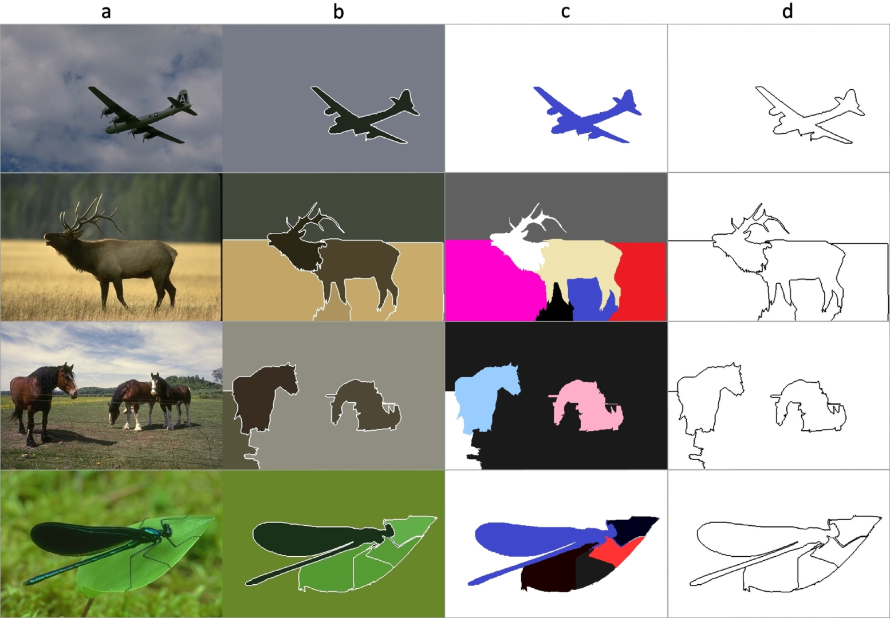

# PSR-MST Image Segmentation
A python implementation of the method described in the paper [Sequential image segmentation based on minimum spanning tree representation](https://www.sciencedirect.com/science/article/abs/pii/S0167865516301192).


## Reference:

```
@article{SAGLAM2017155,
title = "Sequential image segmentation based on minimum spanning tree representation",
journal = "Pattern Recognition Letters",
volume = "87",
pages = "155 - 162",
year = "2017",
note = "Advances in Graph-based Pattern Recognition",
issn = "0167-8655",
doi = "https://doi.org/10.1016/j.patrec.2016.06.001",
url = "http://www.sciencedirect.com/science/article/pii/S0167865516301192",
author = "Ali Saglam and Nurdan Akhan Baykan",
keywords = "Segmentation, Clustering, Graph, Minimum spanning tree, Prim",
abstract = "Image segmentation is a very important stage in various image processing applications. Segmentation of pixels of an image and clustering of data are closely related to each other. For many graph-based data-clustering methods and many graph-based image-segmentation methods, minimum spanning tree (MST)-based approaches play a crucial role because of their ease of operation and low computational complexity. In this paper, we improve a successful data-clustering algorithm that uses Prim’s sequential representation of MST, for the purpose of image segmentation. The algorithm runs by scanning the complete MST structure of the entire image, such that it finds, and then cuts, inconsistent edges among a constantly changing juxtaposed edge string whose elements are obtained from the MST at a specific length. In our method, the length of the string not only determines the edges to compare, but also helps to remove the small, undesired cluster particles. We also develop a new predicate for the cutting criterion. The criterion takes into account several local and global features that differ from image to image. We test our algorithm on a database that consists of real images. The results show that the proposed method can compete with the most popular image segmentation algorithms in terms of low execution time."
}
```



### Dependence:
The code depends on the following third-party libraries:
- fibheap 0.2.1

```
pip install fibheap
```

### Run demo: 
```
python Demo_segmentation.py
```

### Parameters:
*m* : The coefficient of the parameters c that calculated automatically using the differential of the PSR-MST in the [source paper](https://www.sciencedirect.com/science/article/abs/pii/S0167865516301192). If no value is given, the default value is ``3``.

*l* : The length of the scanning frame (sub-string) that scans through the PSR-MST. If no value is given, the default value is ``"scale"`` that computed by ``int( sqrt(M * N) / 2``).

### Segmentation  fuction:

 ``labels = sequential_segmentation(img)`` -----> *m* = 3, *l* = "scale"

``labels = sequential_segmentation(img, m = 4)`` -----> *l* = "scale"

``labels = sequential_segmentation(img, m = 4, l = 200)``


## Reference:

```
@article{SAGLAM2017155,
title = "Sequential image segmentation based on minimum spanning tree representation",
journal = "Pattern Recognition Letters",
volume = "87",
pages = "155 - 162",
year = "2017",
note = "Advances in Graph-based Pattern Recognition",
issn = "0167-8655",
doi = "https://doi.org/10.1016/j.patrec.2016.06.001",
url = "http://www.sciencedirect.com/science/article/pii/S0167865516301192",
author = "Ali Saglam and Nurdan Akhan Baykan",
keywords = "Segmentation, Clustering, Graph, Minimum spanning tree, Prim",
abstract = "Image segmentation is a very important stage in various image processing applications. Segmentation of pixels of an image and clustering of data are closely related to each other. For many graph-based data-clustering methods and many graph-based image-segmentation methods, minimum spanning tree (MST)-based approaches play a crucial role because of their ease of operation and low computational complexity. In this paper, we improve a successful data-clustering algorithm that uses Prim’s sequential representation of MST, for the purpose of image segmentation. The algorithm runs by scanning the complete MST structure of the entire image, such that it finds, and then cuts, inconsistent edges among a constantly changing juxtaposed edge string whose elements are obtained from the MST at a specific length. In our method, the length of the string not only determines the edges to compare, but also helps to remove the small, undesired cluster particles. We also develop a new predicate for the cutting criterion. The criterion takes into account several local and global features that differ from image to image. We test our algorithm on a database that consists of real images. The results show that the proposed method can compete with the most popular image segmentation algorithms in terms of low execution time."
}
```
